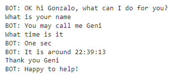
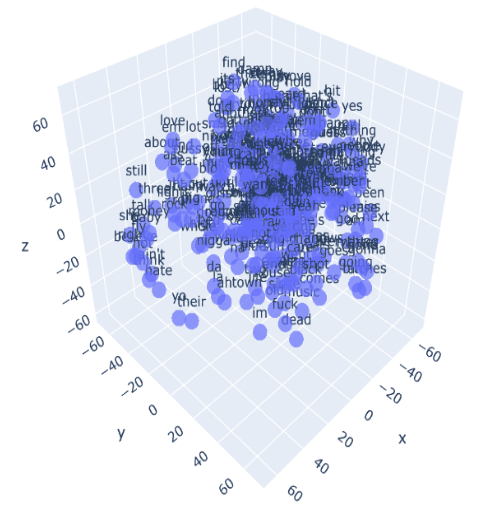
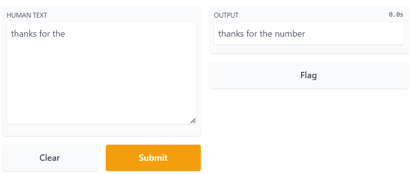
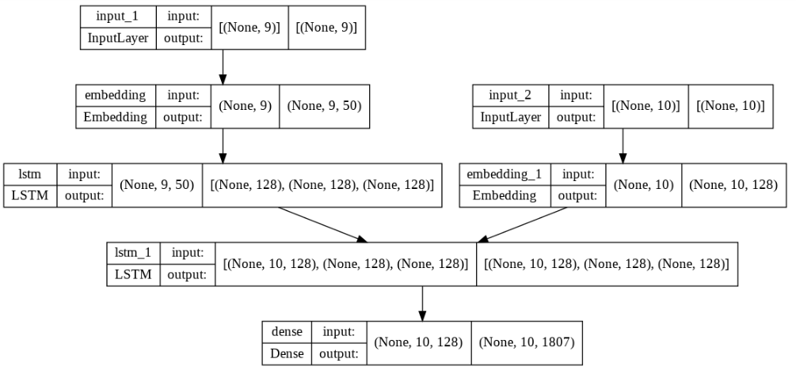

# Natural language processing 
This repository contains material and exercises from the Specialization of Artificial Intelligence from the University of Buenos Aires.

## Projects

### Document vectorization
* Obtain the vocabulary from a example corpus
* Use one hot encoding and get the frequency vectors
* Obtain the the TFIDF matrix and compare the documents 
* https://github.com/GonzaloRomeroR/natural_language_processing/blob/main/clase_1/ejercicios/1a_word2vec.ipynb

### Based on rules bot 
* Use the [Intent Classification](https://www.kaggle.com/datasets?search=Intent+Classification) dataset obtain from Kaggle to create a based on rules bot 
* Work with the spacy library to tokenize and lemmatize
* Train a neuronal network that uses an one hot encoding input to classify and answer the questions based on that classification.
* https://github.com/GonzaloRomeroR/natural_language_processing/blob/main/clase_2/NLP_clase_2_bot.ipynb

### Words embeddings
* Obtain word embeddings of a dataset containing songs lyrics from different artists
* Use Gensim to train a vector embeddings of the songs dataset and display the trained embeddings.
* https://github.com/GonzaloRomeroR/natural_language_processing/blob/main/clase_3/NLP_clase_3_embedding2.ipynb

### Next word prediction
* Make use of a dataset containing emails for next word prediction. The model will predict the next word when a incomplete sentence is passed as input.
* Train a LSTM to make the prediction based on a sequence of words. Use gradio to display the results.
* https://colab.research.google.com/drive/1owbYSSO42JDaNviqa8WkwCL-f9YX7a5r?usp=sharing

### Sentiment analysis using embeddings and LSTM 
*  Use a clothing dataset to classify reviews of clients.
*  Train an LSTM with embeddings in order to classify the reviews in three different classes: bad review, normal review, good review.
*  https://colab.research.google.com/drive/1mTIdpuNX9ZnVGhOm4BRfzhmL89GxOArJ?usp=sharing

### LSTM Conversational Bot
* Create a bot to respond user's questions.
* Use a QA dataset to train the an LSTM model.
* https://colab.research.google.com/drive/1fOVMsdDNtqOI8-O-mm68TIuyO1ujZ9jJ?usp=sharing

